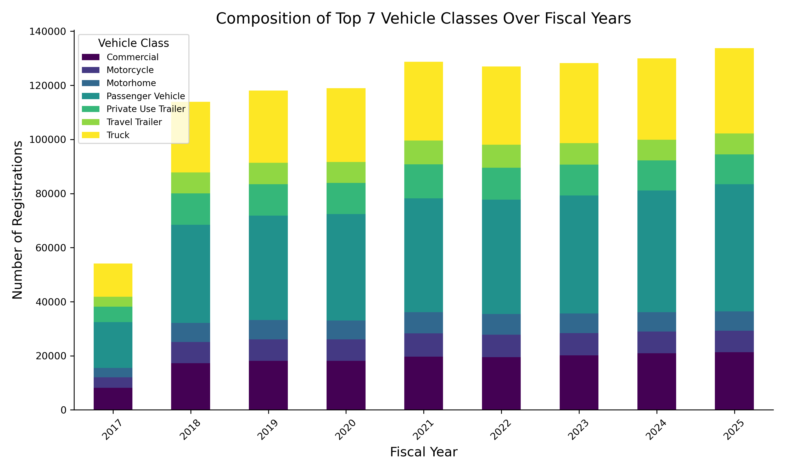
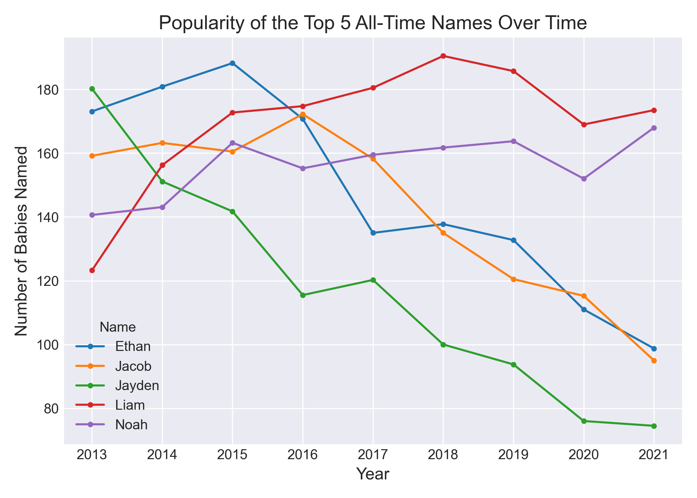

# 📊 Python Data Visualization Showcase

A comprehensive collection of Python scripts demonstrating various data manipulation and visualization techniques using `pandas`, `matplotlib`, and `seaborn`. This repository analyzes two distinct datasets: **Popular Baby Names** and **Vehicle Registrations in Washington State**.

<p align="center">
    
    
</p>

---

## 🚀 Visualizations Included

| Plot Type | Dataset | Description |
| :--- | :--- | :--- |
| 📈 **Multiple Line Chart** | *Baby Names* | Tracks and compares the popularity trends of the top 5 all-time baby names over the years. |
| 🥧 **Pie Chart** | *Baby Names* | Displays the overall gender distribution of babies within the dataset. |
| 📉 **Line Chart** | *Vehicle Reg.* | Illustrates the trend of total vehicle registration transactions per fiscal year. |
| 🗺️ **Heatmap** | *Vehicle Reg.* | Visualizes the dense relationship between the top 10 primary use classes and residential counties. |
| 📊 **Stacked Bar Chart** | *Vehicle Reg.* | Shows the composition and distribution of the top 7 vehicle classes across different fiscal years. |

---

## 🛠️ Technologies Used

- **Python 3**: The core programming language.
- **Pandas**: Used for robust data manipulation, cleaning, filtering, and aggregation (e.g., Pivot Tables, Crosstabs).
- **Matplotlib**: The foundational library for creating static, interactive, and animated visualizations.
- **Seaborn**: A high-level interface built on Matplotlib for drawing attractive and informative statistical graphics.

---

## 📦 Requirements & Installation

To run these scripts, you need **Python 3** installed. Using a virtual environment (`.venv`) is highly recommended.

1. **Clone the Repository:**
   ```bash
   git clone <your-repository-url>
   cd <repository-folder>
   ```

2. **Install Dependencies:**
   Install the required libraries using the provided requirements file:
   ```bash
   pip install -r requirements.txt
   ```
   *(Ensure that the CSV dataset files are located in the same directory as the scripts, typically within the `src` folder).*

3. **Run the Scripts:**
   Execute any of the visualization scripts directly from your terminal:
   ```bash
   # Example: Running the heatmap visualization
   python src/heatmap.py
   ```

---

## 🤝 Support & Feedback

If you found this project helpful or interesting, please consider giving it a **Star** ⭐️ on GitHub! 
Feel free to open an issue or leave a comment if you have any suggestions, feedback, or found a bug. Your input helps make this project better.

## 📬 Contact Me

Let's connect! You can find my links and reach out to me through my GitHub profile bio:
- Check out my [GitHub Profile](https://github.com/ErfannKhastar) for Email, Telegram, LinkedIn, and Instagram links.

---

## 📄 License

This project is licensed under the MIT License - see the [LICENSE](LICENSE) file for details.